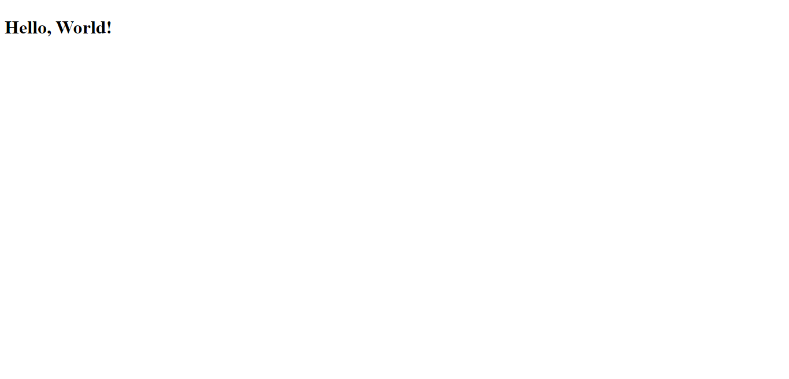

# My First Excercise on Microverse

> In this project I am testing my ability to prepare a a project with git and github Following the guidlines of linting plus learning how to write a pretty cool README file.

| *screenshot of the app.*

## Built With

- Languages: _**HTML**_, _**CSS**_, _**MarkDown**_.
- Frameworks: _**N/A**_.
- Technologies used: _**Git**_, _**GitHub**_.

## Live Demo

[Live Demo Link](https://mrramoun.github.io/First-Excercise-Microverse/)

## Author's Info

- GitHub: [@githubhandle](https://github.com/mrramoun)
- Twitter: [@twitterhandle](https://twitter.com/ramoun16)
- LinkedIn: [LinkedIn](https://www.linkedin.com/in/ramoun/)

## :smile: Contributing

Contributions, issues, and feature requests are welcome!

Feel free to check the [issues page](issues/).

## Show your support

Give a :star: if you like this project!

## Acknowledgments

Thanks to all  my friends that have reviewed my repo.
- [Marco Parra](https://github.com/mrigorir)
- [Francis Ukolo]()
- [Chike](https://github.com/Chike1990)

## 📝 License

This project is [MIT](lic.url) licensed.
